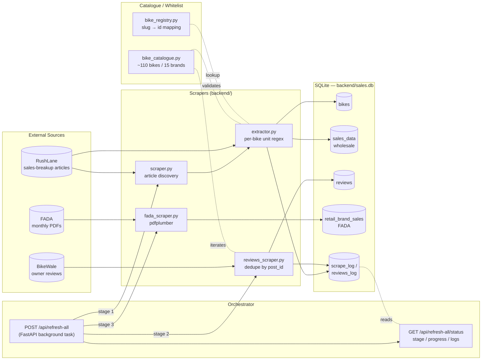
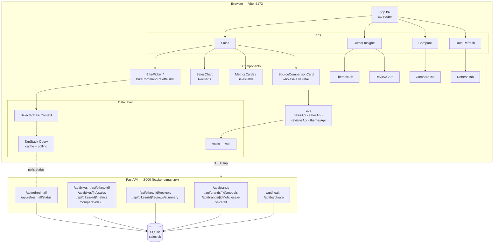
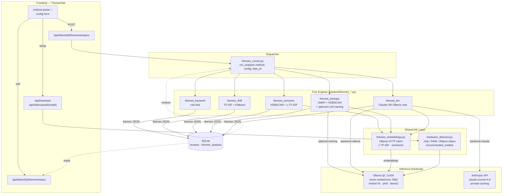

# Architecture

Three views of the system, scoped to the concerns they cover. All Mermaid blocks render directly on GitHub.

---

## 1. Data Engineering

Three independent scrapers feed a single SQLite store. The `/api/refresh-all` endpoint orchestrates them as a 3-stage pipeline (RushLane discovery → BikeWale reviews → FADA PDF parse), with per-stage progress polled by the frontend.

---

## 2. Dashboarding

React 19 + Vite + TS frontend talks to a FastAPI backend over `/api/*`. State is managed by TanStack Query (server) and a `SelectedBike` React Context (global). Charts are Recharts; UI is shadcn/Radix on Tailwind v4.

---

## 3. LLM / Machine Learning

Theme extraction over reviews has five interchangeable engines, all dispatched through `themes_runner`. Embeddings are produced locally by Ollama (`nomic-embed-text`); the LLM stage can run against Anthropic Claude (cloud) or Ollama Mistral (local). `hardware_detector` decides which local models the host can realistically run.

### Engine cheat-sheet

| Method | Local cost | Network | Best for |
|---|---|---|---|
| `keyword` | trivial | none | sanity baseline, offline |
| `tfidf` | low | none | quick clustering when reviews are plentiful |
| `semantic` | medium (embeddings) | Ollama only | denser topics on small corpora |
| `bertopic` | medium-high | Ollama (+optional LLM naming) | interpretable topics with auto-named clusters |
| `llm` | low local | Anthropic **or** Ollama | best narrative themes, sentiment, exemplar quotes |
