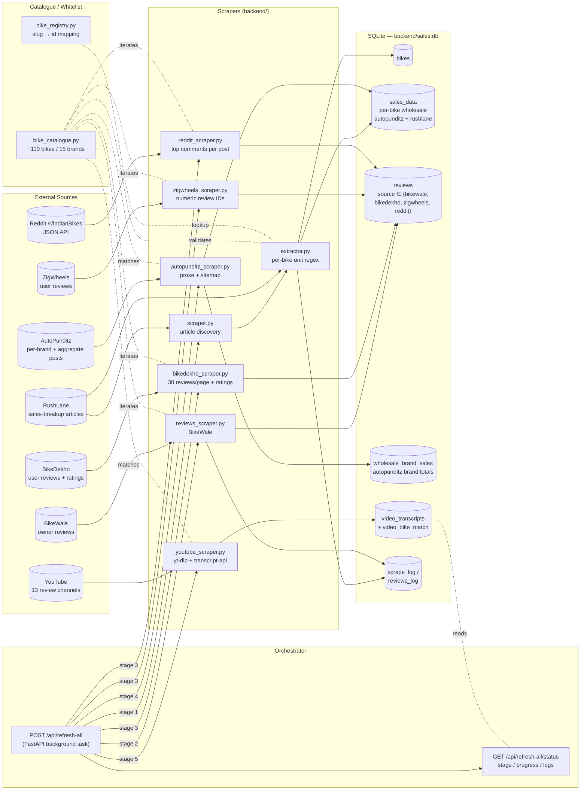
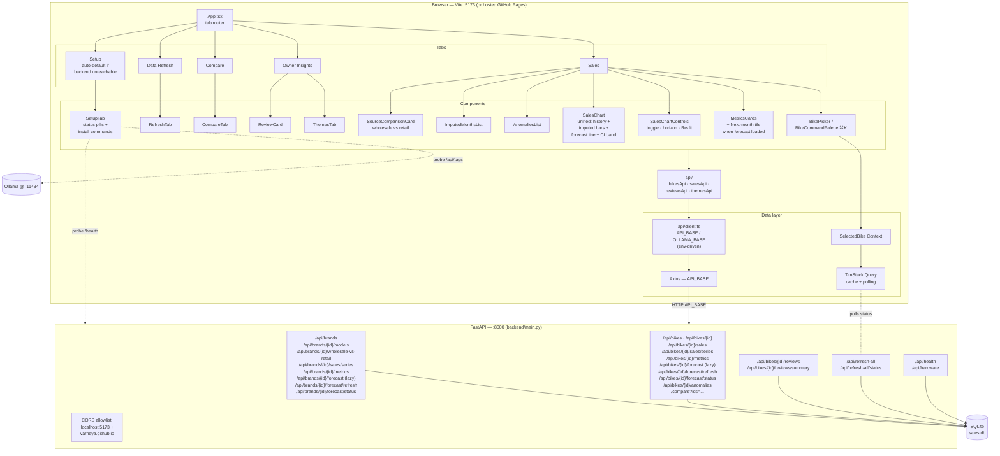
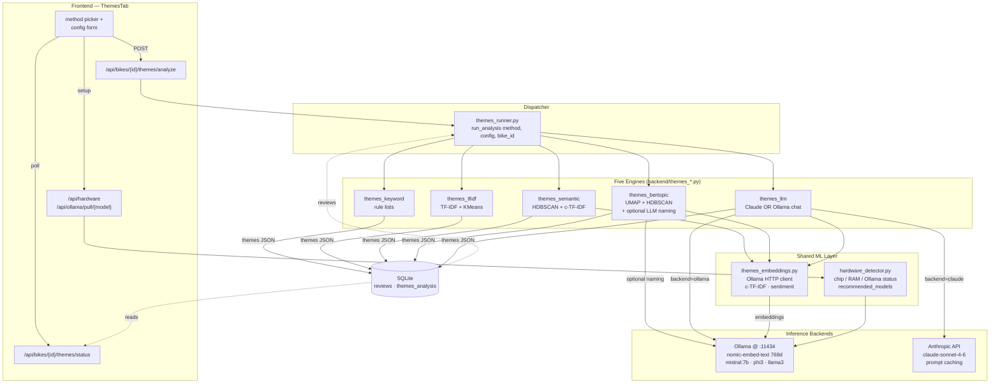
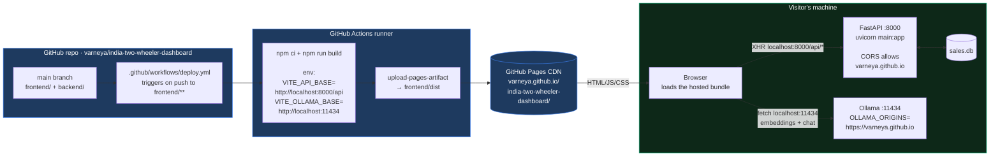

# Architecture

Four views of the system, scoped to the concerns they cover. All Mermaid blocks render directly on GitHub.

1. **Data engineering** — scrapers, catalogue, orchestrator, SQLite store
2. **Dashboarding** — React frontend, FastAPI surface, env-driven API base
3. **LLM / ML** — five theming engines, embeddings, hardware detection
4. **Deployment topology** — GitHub Pages frontend + visitor-local backend + Ollama

---

## 1. Data Engineering

Seven independent scrapers feed a single SQLite store. The `/api/refresh-all` endpoint orchestrates them as a 5-stage pipeline (RushLane discovery → BikeWale reviews → BikeDekho/ZigWheels/Reddit reviews → AutoPunditz prose + brand totals → YouTube transcripts), with per-stage progress polled by the frontend. AutoPunditz is the canonical brand-level wholesale source; RushLane is the model-level fallback.

---

## 2. Dashboarding

React 19 + Vite + TS frontend talks to a FastAPI backend through a shared `API_BASE` (in `api/client.ts`) that defaults to `/api` for local dev (proxied by Vite to `localhost:8000`) and is overridden at build time via `VITE_API_BASE` for the GitHub Pages deploy. State is managed by TanStack Query (server) and a `SelectedBike` React Context (global). Charts are Recharts; UI is shadcn/Radix on Tailwind v4.

---

## 3. LLM / Machine Learning

Theme extraction over reviews has five interchangeable engines, all dispatched through `themes_runner`. Embeddings are produced locally by Ollama (`nomic-embed-text`); the LLM stage can run against Anthropic Claude (cloud) or Ollama Mistral (local). `hardware_detector` decides which local models the host can realistically run.

### Engine cheat-sheet

| Method | Local cost | Network | Best for |
|---|---|---|---|
| `keyword` | trivial | none | sanity baseline, offline |
| `tfidf` | low | none | quick clustering when reviews are plentiful |
| `semantic` | medium (embeddings) | Ollama only | denser topics on small corpora |
| `bertopic` | medium-high | Ollama (+optional LLM naming) | interpretable topics with auto-named clusters |
| `llm` | low local | Anthropic **or** Ollama | best narrative themes, sentiment, exemplar quotes |

---

## 4. Deployment topology

The hosted UI lives on GitHub Pages but is deliberately *empty* of data — it's a static React bundle whose API base is hard-coded at build time to `http://localhost:8000/api`. Visitors run the FastAPI backend (and optionally Ollama) on their own machine; the browser ferries data between the hosted page and the visitor's localhost. Nothing the visitor scrapes or reviews ever leaves their laptop, except the optional Anthropic Claude API call.

**Why this works:**

- Browsers exempt `localhost` from mixed-content blocking, so an HTTPS page can fetch `http://localhost:8000` and `http://localhost:11434`.
- The backend explicitly allowlists `https://varneya.github.io` in CORS (`backend/main.py`).
- Ollama needs `OLLAMA_ORIGINS=https://varneya.github.io` set when started, so its CORS preflight permits the browser request.
- The `SetupTab` component polls both endpoints every ~8 s and surfaces the install commands when either is unreachable, so a fresh visitor lands on a useful page even before they've installed anything.

**Why this is free:** GitHub Pages hosts the static bundle at zero cost, GitHub Actions provides 2000 free CI minutes/month, and all heavy compute (scraping, embeddings, clustering, LLM inference) runs on the visitor's machine. The only paid path is the optional Anthropic Claude API, billed per-call to whoever owns the API key.

**Local-only mode:** `npm run dev` and `uvicorn main:app` work exactly as before — `command !== 'build'` keeps `base: '/'` and the API client's default `/api` is proxied to `localhost:8000` by Vite. The hosted-mode plumbing is purely additive.
